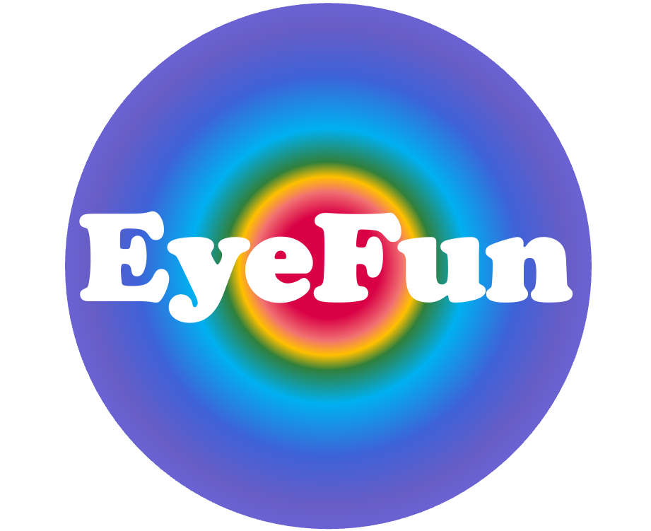

[](https://igmmgi.github.io/EyeFun.jl/dev/)
[](https://github.com/igmmgi/EyeFun.jl/actions/workflows/ci.yml)
[](https://opensource.org/licenses/MIT)


# EyeFun.jl




A Julia package for Eye Tracking visualization and analysis.

## Features

- Parses data files directly using pure Julia
- Built-in support for **EyeLink** (`.edf`, `.asc`), **SMI** (`.idf`, `.txt`), and **Tobii** (`.tsv`)
- Parses fixations, saccades, blinks, messages, input events, and recording metadata
- Extracts continuous gaze/pupil samples at full recording resolution
- Outputs tidy `DataFrame`s ready for analysis
- `create_eyefun_data` — wide per-timestamp DataFrame combining continuous samples with event annotations
- Trial-based data organisation (start/end message markers)

## Installation

```julia
using Pkg
Pkg.add(url="https://github.com/igmmgi/EyeFun.jl") # Currently, unregistered!
```

## Quick Start

```julia
using EyeFun

# Read data from your eye tracker 
dat = read_et_data("path/to/yout/eye_tracking_file/file.edf") # EyeLink (.edf or .asc)

# interactive databrowser
plot_databrowser(dat)                  # whole dataset
plot_databrowser(dat, split_by=:trial) # split by some unique identifier within dataset, here trial
```


<video controls autoplay loop muted src="https://github.com/user-attachments/assets/89daec56-2699-47ff-96a2-3110d4acdda5"></video>

## Other Features

- **I/O Support**: Read from EyeLink (`.edf`, `.asc`), SMI (`.idf`, `.txt`), and Tobii (`.tsv`), and export to ASCII via `write_et_ascii`.
- **Signal Processing**: Basic filtering rules like `velocity_filter!`, `interpolate_blinks!`, and `smooth_pupil!` for data cleaning.
- **Coordinate Conversion**: Built in `deg_to_px` and `px_to_deg` handlers to swap between screen metrics and degrees of visual angle.
- **Areas of Interest (AOIs)**: Define primitive shapes (`RectAOI`, `CircleAOI`, `PolygonAOI`) and extract `aoi_metrics` and `proportion_of_looks`.
- **Scanpath Sequencing**: Extract and compare gaze patterns using `scanpath_similarity` and `transition_matrix`.
- **Detailed Metrics**: Broad statistical extraction parameters for specific behaviours via `fixation_metrics`, `saccade_metrics` (with trajectory curvature), and `pupil_peak_metrics`.
- **Visualization Suite**: Interactive plots via Makie: `plot_databrowser`, `plot_gaze`, `plot_scanpath`, `plot_heatmap`, `plot_fixations`, `plot_pupil`, `plot_velocity`, `plot_dwell`, `plot_sequence`, and `plot_transitions`.

> **Work In Progress**: This is an active exploratory alpha stage codebase. APIs are subject to change without notice. Use at your own risk.

## Acknowledgements

The `.edf` binary file reader was reverse-engineered with significant assistance from Anthropic's Claude (https://claude.com/).
